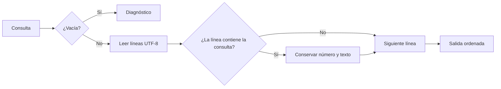

# grep educativo: contrato de búsqueda

## Concepto

Una búsqueda de texto selecciona las líneas de una entrada que satisfacen una
predicado. En esta primera versión el predicado es una subcadena literal; la
herramienta enseña lectura de archivos, modelado de opciones y diagnósticos sin
ocultar sus reglas tras un motor de expresiones regulares.

## Problema

Las herramientas de línea de comandos deben producir resultados repetibles y
errores útiles. Leer un archivo completo sin distinguir una consulta vacía, o
silenciar un fallo de entrada, hace que quien las encadena tome decisiones con
información incompleta.

## Contrato

`rgrep <consulta> <archivo>` lee texto UTF-8 y escribe las líneas que contienen
la consulta. Por defecto la comparación distingue mayúsculas. La opción
`--ignore-case` compara en minúsculas Unicode. Cada coincidencia conserva su
número de línea, empezando en uno.

Una consulta vacía es inválida. Un archivo ausente, no legible o no UTF-8 es un
diagnóstico y termina con estado no exitoso. Una búsqueda válida sin resultados
no es un error: devuelve una salida vacía y estado exitoso.

## Invariantes

- El orden de salida es el orden de las líneas de entrada.
- Cada línea se inspecciona una sola vez y aparece a lo sumo una vez.
- El número de línea corresponde a la posición original, aun cuando no haya
  coincidencias previas.
- `--ignore-case` cambia solo la comparación, nunca el texto mostrado.

## Alternativas y decisión

Podríamos incluir expresiones regulares, recorridos recursivos o archivos
binarios. Son capacidades valiosas, pero introducen semánticas adicionales:
escapes, codificaciones y políticas de recorrido. Elegimos subcadenas sobre
texto UTF-8 para que el núcleo quede visible y pueda probarse sin dependencias.

## Límites honestos

No hay expresiones regulares, búsqueda recursiva, colores, contexto de líneas,
lectura desde entrada estándar ni soporte binario. El modelo carga el archivo
completo y no pretende reemplazar a `grep` de producción.

## Recorrido



## Ejemplos progresivos

La API separa la comparación del acceso a archivos para que sus pruebas no
dependan del sistema operativo:

```rust
use rust_projects::grep::{search, SearchOptions};

let matches = search("Rust", "Rust\nGo\nRustacean", SearchOptions {
    ignore_case: false,
})?;
assert_eq!(matches[0].line_number, 1);
# Ok::<(), String>(())
```

Para una comparación que no distinga mayúsculas, la salida conserva el texto
original. Solo se normaliza el predicado:

```rust
# use rust_projects::grep::{search, SearchOptions};
let matches = search("rust", "Rust\nrust", SearchOptions {
    ignore_case: true,
})?;
assert_eq!(matches.len(), 2);
# Ok::<(), String>(())
```

## Ejercicios

1. Agrega una opción que invierta el predicado y conserva la numeración
   original de las líneas.
2. Diseña una función de frontera que lea un archivo y traduzca el error de
   UTF-8 a un diagnóstico para la terminal.
3. Explica por qué una expresión regular no debe incorporarse sin redefinir
   el contrato de errores y escapes.

## Soluciones orientativas

1. Elige el predicado una sola vez, antes del recorrido; no reordenes ni
   reconstruyas las coincidencias.
2. Mantén la lectura fuera de `search`: así los casos de búsqueda se prueban
   con texto en memoria y el diagnóstico de E/S se prueba por separado.
3. Las expresiones regulares introducen un lenguaje nuevo. Sus patrones
   inválidos son errores de compilación del patrón, no búsquedas sin resultados.
