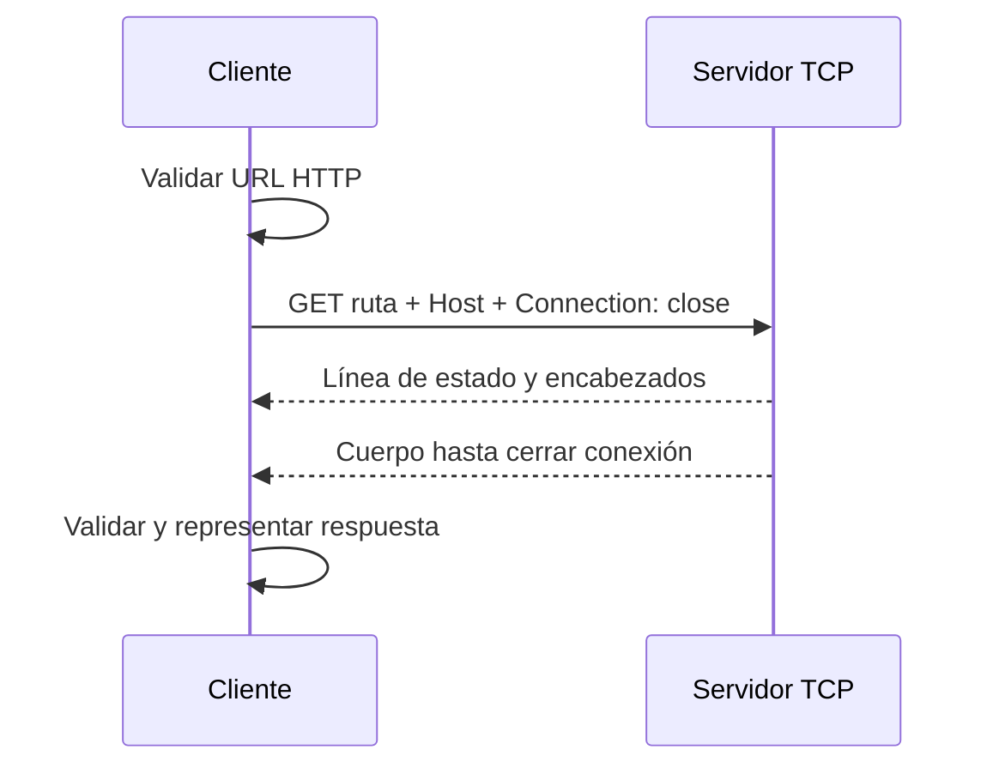

# curl educativo: contrato de un cliente HTTP

## Concepto y problema

Un cliente HTTP traduce una URL y una intención en bytes sobre TCP, y traduce
la respuesta de vuelta a una representación que un programa puede inspeccionar.
El riesgo didáctico es esconder ese intercambio bajo una dependencia antes de
entender qué debe validarse.

## Contrato

`rget` acepta únicamente URLs `http://host[:puerto]/ruta` y emite una solicitud
`GET` HTTP/1.1 con encabezado `Host` y `Connection: close`. La respuesta debe
tener una línea de estado, encabezados ASCII y un cuerpo que conserva sus bytes
tal como llegaron. La función de parsing trabaja sobre bytes; la frontera de
red usa `TcpStream` de la biblioteca estándar.

## Invariantes

- La URL debe declarar esquema `http` y un host no vacío.
- Cada encabezado ocupa una sola línea y se normaliza su nombre a minúsculas.
- El estado es un entero de tres dígitos entre 100 y 599.
- Un mensaje incompleto es un error, nunca una respuesta parcial exitosa.

## Alternativas y decisión

Podríamos usar `reqwest` o `hyper`. Son decisiones sensatas para producción,
pero ocultan framing, límites y errores de parsing. Elegimos HTTP/1.1 mínimo
con cierre de conexión para observar el protocolo sin introducir TLS, chunks,
redirects o un runtime asíncrono.

## Límites honestos

No hay HTTPS, redirects, autenticación, proxies, `chunked`, compresión,
cookies, pooling ni timeouts configurables. Este cliente sirve para aprender el
camino de bytes y no para salir a internet con garantías de producción.

## Recorrido



## Ejemplos progresivos

Primero se valida y descompone la URL:

```rust
use rust_projects::curl::parse_http_url;

let url = parse_http_url("http://example.test:8080/salud")?;
assert_eq!(url.port, 8080);
# Ok::<(), String>(())
```

Luego se puede observar exactamente qué bytes saldrían por TCP:

```rust
# use rust_projects::curl::{build_get_request, parse_http_url};
let request = build_get_request(&parse_http_url("http://example.test/")?);
assert!(String::from_utf8(request)?.starts_with("GET / HTTP/1.1"));
# Ok::<(), Box<dyn std::error::Error>>(())
```

## Ejercicios

1. Añade soporte para una ruta vacía sin aceptar un host vacío.
2. Modela un límite máximo de encabezados y explica el error que produciría.
3. Explica por qué `Transfer-Encoding: chunked` requiere otro parser, no solo
   una nueva cabecera en la respuesta actual.

## Soluciones orientativas

1. Normaliza la ruta a `/` durante el parsing de URL, antes de serializar.
2. Cuenta encabezados mientras se parsean y rechaza entradas excesivas antes
   de reservar o procesar trabajo adicional.
3. El cuerpo actual termina al cerrar conexión; los chunks llevan su propio
   framing y deben validarse antes de reconstruir el cuerpo.
