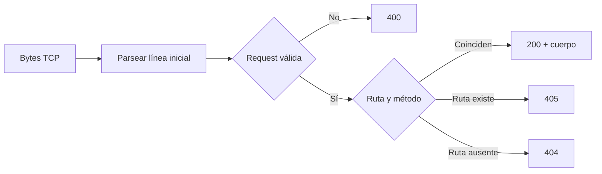

# Servidor HTTP educativo: contrato de request y routing

## Concepto y problema

Un servidor HTTP decide cómo transformar bytes de una conexión en una request,
cómo seleccionar una ruta y cómo volver a serializar una respuesta. La frontera
importante es rechazar una request ambigua antes de que alcance la lógica de
negocio.

## Contrato

El modelo acepta una request HTTP/1.1 sin cuerpo: método, ruta y encabezados.
Un router exacto asocia `(método, ruta)` a un texto de respuesta. Las rutas
ausentes producen `404`; los métodos no registrados para una ruta existente,
`405`; y el input inválido, `400`.

## Invariantes

- La línea inicial contiene exactamente método, ruta y versión.
- La ruta empieza con `/` y no contiene saltos de línea.
- Los nombres de encabezado se normalizan en minúsculas.
- Toda respuesta tiene estado, `Content-Length` y una única secuencia de
  encabezados terminada por una línea vacía.

## Alternativas y decisión

Un framework ofrecería routing paramétrico, middleware y concurrencia. En esta
etapa elegimos un router en memoria y rutas exactas: enseña la separación entre
parsing, resolución y serialización sin prometer HTTP completo.

## Límites honestos

No hay cuerpos, keep-alive, HTTP/2, rutas con parámetros, TLS, concurrencia ni
protección contra solicitudes lentas. La implementación es un núcleo probado,
no un servidor de internet.

## Recorrido



## Ejemplos progresivos

```rust
use rust_projects::http_server::{Request, Router};

let router = Router::new().route("GET", "/salud", "ok");
let response = router.handle(Request { method: "GET".into(), path: "/salud".into() });
assert_eq!(response.status, 200);
```

El router no abre sockets: esa separación permite explicar y probar su
semántica antes de introducir concurrencia o tiempos de espera.

## Ejercicios

1. Agrega una respuesta `400` para una versión HTTP desconocida.
2. Propón cómo modelar encabezados sin permitir repetición ambigua.
3. Explica dónde introducirías un límite de tamaño de request para no asignar
   memoria sin límite.

## Soluciones orientativas

1. La decisión ocurre durante `parse_request`, antes del router.
2. Usa una colección ordenada si importa preservar orden; define explícitamente
   si una clave duplicada es error o una lista de valores.
3. El límite pertenece a la lectura desde la conexión, antes de entregar bytes
   al parser; el modelo actual deja esa frontera fuera de alcance.
