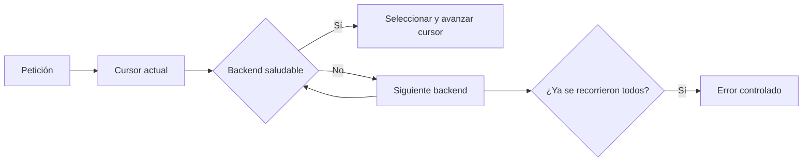

# Balanceador educativo: backends y round-robin

## Concepto y problema

Un balanceador separa una entrada estable de varios backends. Su decisión debe
ser explicable: una petición no debe elegir un destino muerto ni depender de un
orden accidental de memoria.

## Contrato e invariantes

El modelo conserva una lista ordenada de backends con estado de salud. Cada
selección round-robin escoge el siguiente backend saludable y avanza el cursor
una vez. Si no existe ninguno saludable, devuelve un error controlado. La
selección no ejecuta health checks: recibe su resultado como estado explícito.

## Alternativas y decisión

Least-connections, peso y hashing consistente necesitan métricas o identidad
de cliente. Elegimos round-robin para aislar la invariante de justicia básica
antes de mezclar observabilidad y políticas de afinidad.

## Límites honestos

No hay proxy de bytes, reintentos, timeouts, health checks activos, pesos ni
concurrencia. Es un scheduler determinista, no un balanceador de producción.

## Recorrido



## Ejemplo

```rust
use rust_projects::load_balancer::{Backend, RoundRobin};

let mut scheduler = RoundRobin::new(vec![
    Backend { address: "a:8080".into(), healthy: true },
    Backend { address: "b:8080".into(), healthy: true },
]);
assert_eq!(scheduler.select_next()?.address, "a:8080");
# Ok::<(), String>(())
```

## Ejercicios y soluciones orientativas

1. Agrega pesos sin perder determinismo. Solución: materializa una secuencia
   ponderada y declara el costo de memoria.
2. Diseña un health check activo. Solución: actualiza salud en una frontera
   separada; `select_next` no debe hacer E/S.
3. Explica cómo evitar carreras con concurrencia. Solución: protege cursor y
   estado con una sincronización explícita, y mide su contención.
