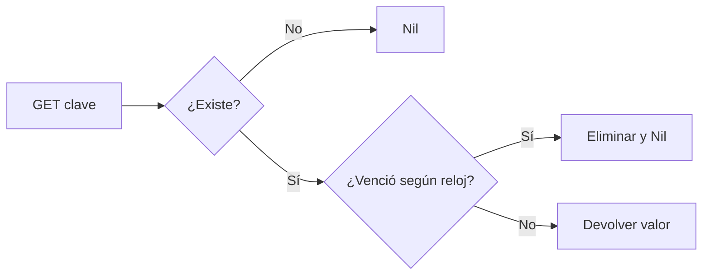

# Redis educativo: claves, valores y expiración

## Concepto y problema

Una base de datos clave-valor mantiene estado pequeño con operaciones simples.
El detalle que vuelve difícil este modelo es el tiempo: una clave vencida no
debe reaparecer por accidente ni requerir un barrido global para dejar de ser
visible.

## Contrato e invariantes

El modelo expone `SET`, `GET`, `DEL` y `EXPIRE` sobre claves UTF-8. Cada valor
puede tener un vencimiento absoluto expresado por un reloj inyectado. `GET`
elimina de manera perezosa una clave vencida y responde como si no existiera.
`EXPIRE` devuelve falso cuando la clave ya no existe.

- Una clave vencida jamás se devuelve como valor vivo.
- `SET` reemplaza valor y vencimiento previos de forma atómica dentro del
  modelo.
- El reloj pertenece a la frontera del sistema, no a cada operación.

## Alternativas y decisión

Redis real usa RESP, persistencia, replicación y una amplia superficie de tipos.
Elegimos un mapa en memoria y reloj explícito para estudiar consistencia de
expiración sin convertir este curso en una reimplementación de producción.

## Límites honestos

No hay red, RESP, persistencia, pub/sub, transacciones, listas, sets,
evicción de memoria ni concurrencia. La expiración es perezosa y didáctica.

## Recorrido



## Ejemplo

```rust
use rust_projects::redis::Store;

let mut store = Store::default();
store.set("curso", "Rust");
assert!(store.expire("curso", 10));
assert_eq!(store.get("curso", 9), Some("Rust".into()));
assert_eq!(store.get("curso", 10), None);
```

## Ejercicios y soluciones orientativas

1. Añade `TTL`. Solución: distingue clave ausente de clave sin vencimiento y
   calcula la diferencia sin modificar estado.
2. Diseña persistencia. Solución: primero define un formato y su manejo ante
   corrupción; no serialices el mapa sin un contrato de recuperación.
3. Agrega concurrencia. Solución: protege mapa y reloj como fronteras distintas
   y prueba que `GET` y expiración siguen siendo atómicos para cada clave.
