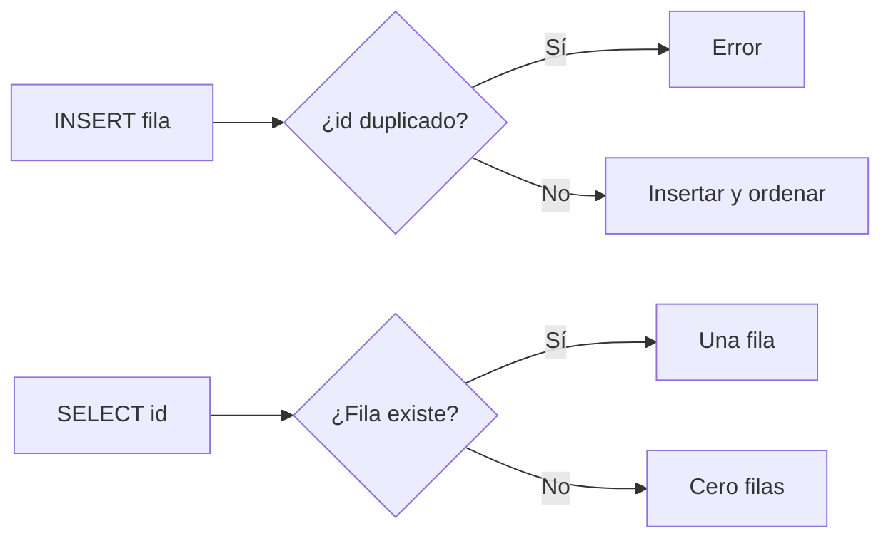

# SQLite educativo: páginas, tabla y consultas

## Concepto y problema

Una base de datos relacional convierte filas en una representación que puede
persistir, localizarse y consultarse. Antes de un árbol B o SQL completo,
necesitamos decidir qué significa que una fila exista y cómo una consulta
conserva un orden determinista.

## Contrato e invariantes

El modelo almacena una tabla de filas `(id, texto)` en páginas de tamaño fijo.
`INSERT` rechaza identificadores duplicados; `SELECT` por identificador devuelve
cero o una fila; `SCAN` devuelve filas por id ascendente. Una página no excede
su capacidad declarada y una inserción no modifica otra fila.

## Alternativas y decisión

SQLite real emplea formato binario, pager, árbol B, journaling y SQL. Elegimos
páginas en memoria y una tabla mínima para mostrar la relación entre capacidad,
identidad y consulta sin afirmar durabilidad que el modelo no ofrece.

## Límites honestos

No hay archivos, SQL parser, transacciones, índices secundarios, tipos
dinámicos, concurrencia, recuperación ni árbol B. Es una base para razonar
sobre almacenamiento, no SQLite compatible.

## Recorrido



## Ejemplo

```rust
use rust_projects::sqlite::{Row, Table};

let mut table = Table::new(2);
table.insert(Row { id: 2, text: "dos".into() })?;
table.insert(Row { id: 1, text: "uno".into() })?;
assert_eq!(table.scan_page(0)[0].id, 1);
# Ok::<(), String>(())
```

## Ejercicios y soluciones orientativas

1. Añade una segunda página. Solución: conserva el cálculo de frontera
   `página * capacidad` y prueba páginas vacías y parciales.
2. Propón un índice. Solución: define primero cómo se sincroniza con la tabla
   al insertar; un índice desactualizado es corrupción lógica.
3. Diseña transacciones. Solución: declara una unidad de cambio y una política
   de fallo antes de introducir un journal.
