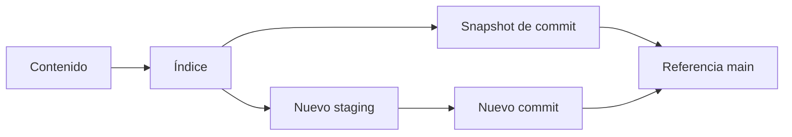

# Git educativo: objetos, índice y referencias

## Concepto y problema

Un sistema de control de versiones representa historia como datos inmutables y
referencias mutables. La dificultad no es crear un identificador: es preservar
la relación entre contenido, índice, commit y rama sin mutar el pasado.

## Contrato e invariantes

El modelo guarda blobs por hash determinista, un índice de rutas a blobs,
commits que capturan una fotografía del índice y referencias que apuntan a un
commit. Crear un commit no modifica commits previos; actualizar una referencia
no modifica sus objetos; una ruta del índice tiene a lo sumo un blob.

## Alternativas y decisión

Git real incluye árboles, SHA, áreas de staging, merge y un formato de disco.
Elegimos identificadores educativos y mapas en memoria para concentrarnos en
inmutabilidad, snapshots y referencias sin alegar compatibilidad binaria.

## Límites honestos

No hay filesystem, SHA real, árboles anidados, merge, remoto, hooks, firma ni
garbage collection. El modelo ilustra el grafo de historia, no reemplaza Git.

## Recorrido



## Ejemplo

```rust
use rust_projects::git::Repository;

let mut repo = Repository::default();
repo.stage("README.md", "v1");
let commit = repo.commit("main");
assert_eq!(repo.snapshot(commit).unwrap()["README.md"], "v1");
```

## Ejercicios y soluciones orientativas

1. Añade una rama. Solución: una rama es otra referencia mutable al mismo id.
2. Modela un árbol. Solución: transforma rutas en una estructura jerárquica,
   manteniendo objetos inmutables.
3. Diseña merge. Solución: define una base común y una política explícita para
   conflictos antes de crear un commit resultante.
