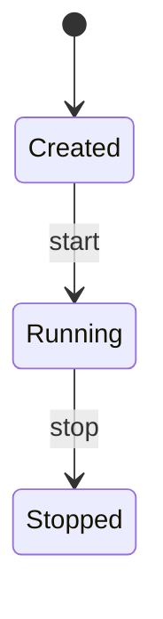

# Docker educativo: imágenes y ejecución conceptual

## Concepto y problema

Un contenedor combina una imagen inmutable con una configuración de ejecución.
La parte educativa es separar la identidad del artefacto de la instancia que lo
usa, sin confundir el modelo con aislamiento real del sistema operativo.

## Contrato e invariantes

Una imagen contiene capas ordenadas e inmutables. Crear un contenedor copia la
referencia a su imagen y recibe un id único, estado `created` y configuración.
Iniciar solo permite `created -> running`; detener solo `running -> stopped`.
Una transición inválida no modifica estado.

## Alternativas y decisión

Docker real usa namespaces, cgroups, capas de filesystem, registry y runtime.
Elegimos una máquina de estados en memoria para estudiar identidad y ciclo de
vida sin hacer afirmaciones de seguridad o aislamiento.

## Límites honestos

No hay procesos reales, imágenes OCI, filesystem, red, namespaces, cgroups,
volúmenes, registry ni ejecución de comandos. No es un sandbox.

## Recorrido



## Ejemplo

```rust
use rust_projects::docker::{Container, State};

let mut container = Container::new("curso:1", 1);
container.start()?;
assert_eq!(container.state, State::Running);
# Ok::<(), String>(())
```

## Ejercicios y soluciones orientativas

1. Agrega eliminación. Solución: define si un contenedor `running` puede
   eliminarse o exige `stopped`, y prueba que la transición sea atómica.
2. Modela capas. Solución: usa una lista inmutable en la imagen, no cambios a
   una instancia ya creada.
3. Explica aislamiento real. Solución: los namespaces y cgroups son frontera
   del kernel; este modelo no los representa ni debe prometerlos.
