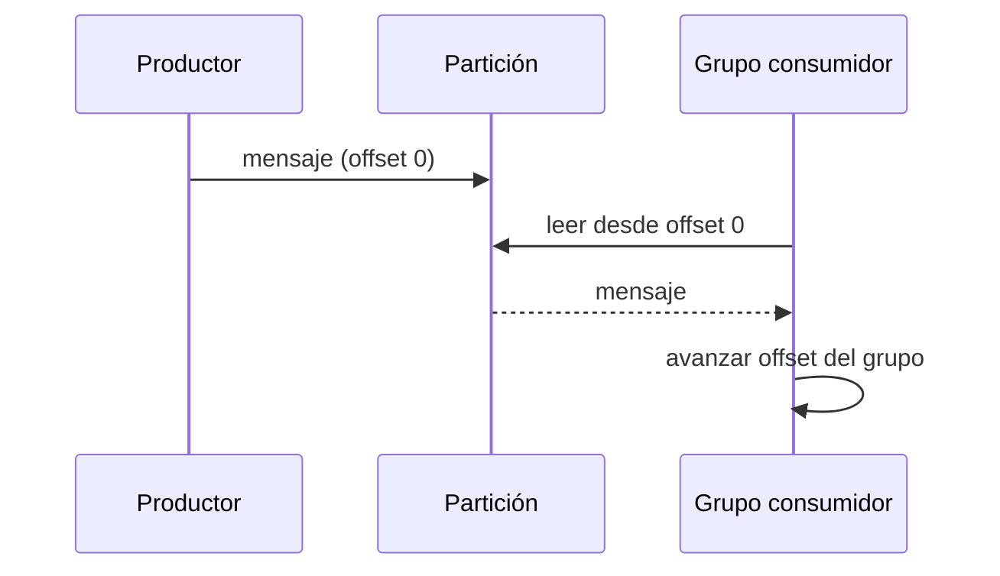

# Kafka educativo: log, particiones y consumidores

## Concepto y problema

Un log distribuido representa hechos como una secuencia ordenada por partición.
El consumidor no elimina mensajes: conserva su offset y puede retomar desde una
posición explícita. La frontera educativa es no prometer orden global ni
durabilidad que el modelo no implementa.

## Contrato e invariantes

Un topic tiene particiones identificadas. Producir agrega un mensaje al final
de una partición y devuelve su offset. Consumir desde un offset devuelve los
mensajes posteriores en el orden de esa partición. Cada grupo mantiene un
offset independiente. Un offset nunca disminuye automáticamente.

## Alternativas y decisión

Kafka real incluye brokers, replicas, ISR, retención, protocolos y rebalanceo.
Elegimos un log en memoria para estudiar particiones, offsets y relectura sin
simular una garantía distribuida inexistente.

## Límites honestos

No hay red, persistencia, replicación, consumidores concurrentes, rebalanceo,
retención, claves, compaction ni garantías exactly-once.

## Recorrido



## Ejemplo

```rust
use rust_projects::kafka::Topic;

let mut topic = Topic::new(1);
topic.produce(0, "curso iniciado")?;
assert_eq!(topic.consume("alumnos", 0)?, Some("curso iniciado".into()));
# Ok::<(), String>(())
```

## Ejercicios y soluciones orientativas

1. Añade varias particiones. Solución: declara cómo se elige partición antes de
   hablar de orden global.
2. Modela retención. Solución: elimina sólo mensajes previos a un límite y
   define qué ocurre con offsets que apuntan antes del inicio.
3. Diseña commit manual. Solución: separa lectura de actualización del offset
   para enseñar la diferencia entre at-most-once y at-least-once.
